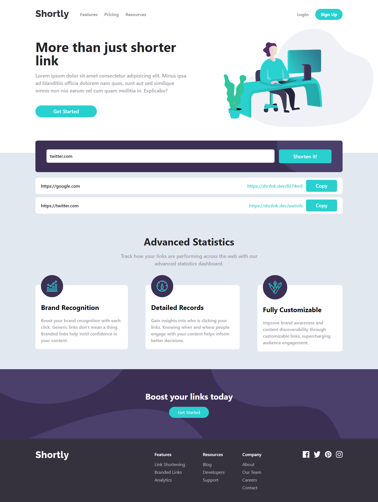

# URL Shortening

This Project is based on a challenge from Frontend Mentor [(URL shortening API landing page)](https://www.frontendmentor.io/challenges/sunnyside-agency-landing-page-7yVs3B6ef).

## Overview

### About The Project

This project is a landing page for a URL Shortening API. It allows users to shorten long URLs, view a list of their shortened URLs, and copy them to the clipboard. The design and functionality are based on a challenge from Frontend Mentor.

### The challenge

The main challenge was to create a fully responsive landing page that integrates with a URL shortening API to provide a seamless user experience. The page needed to be visually appealing, user-friendly, and functional across various devices and screen sizes.

### Screenshot

**Tampilan Desktop**

### Links

- Solution URL: [Solution code](https://github.com/abimh66/url-shortening)
- Live Site URL: [Live site](https://url-shortening-abimh66.netlify.app/)

## Process

### Tech Stack

- ReactJS
- [Tailwind CSS](https://tailwindcss.com/) - CSS Framework
- [shrtlnk.dev API](https://shrtlnk.dev/developer)

### What I learned

Working on this project, I gained experience in:

- **Responsive Design:** Implemented a mobile-first design approach to ensure the landing page is fully responsive.
- **ReactJS:** Utilized ReactJS to build dynamic and interactive user interfaces.
- **Tailwind CSS:** Applied utility-first CSS for rapid and efficient styling.
- **Fetch API:** Learned to interact with the shrtlnk.dev API for retrieving shortened URLs.
- **Form Validation:** Improved my skills in handling form inputs and validating user data before sending it to the API.
- **Dynamic Rendering:** Used ReactJS to dynamically render the shortened URLs on the page.

### Resources

- [MDN Web Docs - Fetch API](https://developer.mozilla.org/en-US/docs/Web/API/Fetch_API)
- [shrtlnk.dev API Documentation](https://shrtlnk.dev/developer/documentation)
- [Tailwind CSS Documentation](https://tailwindcss.com/docs/installation)

## Author

- Twitter - [@abimhrdnt](https://www.twitter.com/abimhrdnt)
- Frontend Mentor - [@abimh66](https://www.frontendmentor.io/profile/abimh66)
- Codewars - [@abimh66](https://www.codewars.com/users/abimh66)
